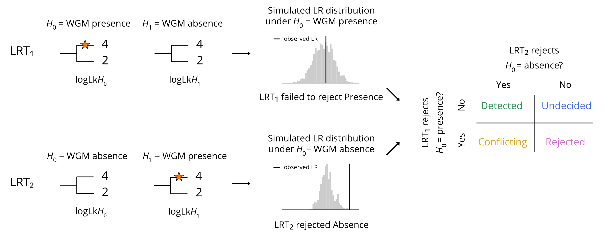

# BirthDeathModel

BirthDeathModel v2 is a command line tool implementing complementary log-likelihood ratio tests (cLRTs) for whole genome multiplication (WGM) inference using gene families' gene count profiles.

The original concept of the birth-death model has been described in Tasdighian et al. 2017 and released under [v1.0.0](https://github.com/VIB-PSB/BirthDeathModel/tree/v1.0.0). Given as input a species tree, WGM nodes on its branches and a gene family size profile across the species concerned, the model computes the likelihood of the observed gene family size profile conditioned on a duplication/loss rate lambda and a gene family size *r* at the root of the species tree. For any given gene family, this likelihood is maximized as a function of lambda for any fixed *r* between 1 and 20 using a cutting-plane optimization method.


## Installation

The JAR file is provided in the present GitHub directory under the [Release](/releases) section (built with Java 11).

To instead build it locally, clone or download this repository to your local machine and navigate in a terminal to the root directory of the project.
Entering the following [maven](https://maven.apache.org/) command will generate the jar file with dependencies in the `target/` directory:

```sh
mvn clean package
```

If you want to make your CLI app available system-wide, you can install it by copying the executable `jar` file to a directory included in your system's `PATH`.


## Usage

The tool help menu with the available commands is displayed by running the following:

```sh
java -jar target/cLRTs_for_WGMs-1.0-jar-with-dependencies.jar -h
```

```sh
Usage: cLRTs [-hV] [COMMAND]
Complementary LRTs for WGM inference
  -h, --help      Show this help message and exit.
  -V, --version   Print version information and exit.
Commands:
  posObs      Observed LRT on positive WGMs
  posSimFull  Simulated LRT with H0Full on positive WGMs
  posSimRm    Simulated LRT with H0Rm on positive WGMs
  posPP       Post-Processing of positive WGMs
  negObs      Observed LRT on negative WGMs
  negSimFull  Simulated LRT with H0Full on negative WGMs
  negSimNeg   Simulated LRT with H0Neg on negative WGMs
  negPP       Post-Processing of negative WGMs
```


Each command help menu is displayed by running the following:

```sh
java -jar target/cLRTs_for_WGMs-1.0-jar-with-dependencies.jar <command> -h
```

For example, for `posObs`:
```sh
Usage: cLRTs posObs [-hV] -c=COUNT_PROFILE -gf=CURRENT_GF_RANK -out=OUTPUT_FILE
                    -r=LAMBDA_RANKING -t=SPECIES_TREE -w=WGM_LIST
Observed LRT on positive WGMs
  -c, --count_profile=COUNT_PROFILE
                            Gene count profile filepath
      -gf, --gene_family_rank=CURRENT_GF_RANK
                            Gene family rank (starts from 0)
  -h, --help                Show this help message and exit.
      -out, --output_file=OUTPUT_FILE
                            Output filepath
  -r, --ranking=LAMBDA_RANKING
                            Gene family ranking filepath
  -t, --tree=SPECIES_TREE   Species tree filepath
  -V, --version             Print version information and exit.
  -w, --wgm=WGM_LIST        WGM list filepath
```

To execute a command, enter its required arguments:

```sh
java -jar target/cLRTs_for_WGMs-1.0-jar-with-dependencies.jar <command> --arguments
```

In the next sections, only the command name and the arguments will be shown.


## Testing Positive WGMs

A "positive" WGM has a certain or very strong evidence in literature.

The two tested hypotheses are:
- `Full`: the tree contains all positive WGMs (test for presence of current WGM)
- `Rm`: the tree contains all positive WGMs *but one* (test for absence of current WGM)

The workflow is structured as illustrated and explained below:



1. First calculate optimal root size, lambda and log-likelihood for H0Full and H1Rm on the observed gene count profile.
    ```sh
    posObs -c COUNT_PROFILE -gf CURRENT_GF_RANK -r LAMBDA_RANKING -t SPECIES_TREE -w WGM_LIST -out OUTPUT_FILE
    ```

2. Then calculate optimal root size, lambda and log-likelihood for H0Full and H1Rm on 1000 gene count profiles simulated according to H0Full. Perform the first LRT (LRT<sub>1</sub>).
    ```sh
    posSimFull -o OBSERVED_LRT -gf CURRENT_GF_RANK -r LAMBDA_RANKING -t SPECIES_TREE -w WGM_LIST -out OUTPUT_FILE
    ```

3. In parallel, calculate optimal root size, lambda and log-likelihood for H0Rm and H1Full on 1000 gene count profiles simulated according to H0Rm. Perform the second LRT (LRT<sub>2</sub>).
    ```sh
    posSimRm -o OBSERVED_LRT -gf CURRENT_GF_RANK -r LAMBDA_RANKING -t SPECIES_TREE -w WGM_LIST -out OUTPUT_FILE
    ```

4. Finally, post-process the two complementary cLRTs through decision-making rules and obtain the inference of the positive WGMs.

   Either provide a comma-separated list of ranks of the analyzed gene families (e.g. `-gf_list 1,2,3`):
    ```sh
    posPP -gf_list GF_RANK_LIST -sim_full SIMULATED_H0FULL -sim_rm SIMULATED_H0RM -obs OBSERVED_LRT -num_w NUMBER_WGM -fdr FDR_THRESHOLD -out OUTPUT_FILE
    ```

    Or else provide the starting and ending ranks of top and bottom ranges (e.g. `-gf_range 0 99 9128 9177`); use -1 to ignore a range (e.g. `-gf_range 0 99 -1 -1`):
    ```sh
    posPP -gf_range START_TOP END_TOP START_BOTTOM END_BOTTOM -sim_full SIMULATED_H0FULL -sim_rm SIMULATED_H0RM -obs OBSERVED_LRT -num_w NUMBER_WGM -fdr FDR_THRESHOLD -out OUTPUT_FILE
    ```

    By combining the two cLRTs, this step generates four possible inference outcomes:
        
    - WGM detection (H0Full not rejected & H0Rm rejected)
        
    - WGM rejection (H0Full rejected & H0Rm not rejected)

    - Undecided outcome (H0Full not rejected & H0Rm not rejected)

    - Conflicting outcome (H0Full rejected & H0Rm rejected)


## Testing negative WGMs

A "negative" WGM has a very weak or null evidence in literature.

The two tested hypotheses are:
- `Full`: the tree contains all positive WGMs and *no* negative WGM (test for absence of current WGM)
- `Neg`: the tree contains all positive WGMs plus *one* negative WGM (test for presence of current WGM)

The workflow is structured in the following ordered steps (similarly to the instructions listed for the positive WGMs above):

1. First calculate optimal root size, lambda and log-likelihood for H0Full and H1Neg on the observed gene count profile.
    ```sh
    negObs -c COUNT_PROFILE -gf CURRENT_GF_RANK -r LAMBDA_RANKING -t SPECIES_TREE -w WGM_LIST -out OUTPUT_FILE
    ```

2. Then calculate optimal root size, lambda and log-likelihood for H0Full and H1Neg on 1000 gene count profiles simulated according to H0Full. Perform the first LRT (LRT<sub>1</sub>).
    ```sh
    negSimFull -o OBSERVED_LRT -gf CURRENT_GF_RANK -r LAMBDA_RANKING -t SPECIES_TREE -w WGM_LIST -out OUTPUT_FILE
    ```

3. In parallel, calculate optimal root size, lambda and log-likelihood for H0Neg and H1Full on 1000 gene count profiles simulated according to H0Neg. Perform the second LRT (LRT<sub>2</sub>).
    ```sh
    negSimRm -o OBSERVED_LRT -gf CURRENT_GF_RANK -r LAMBDA_RANKING -t SPECIES_TREE -w WGM_LIST -out OUTPUT_FILE
    ```

4. Finally, post-process the two complementary LRTs through decision-making rules and obtain the inference of the negative WGMs.

    Either provide a comma-separated list of ranks of the analyzed gene families (e.g. `-gf_list 1,2,3`):
    ```sh
    negPP -gf_list GF_RANK_LIST -sim_full SIMULATED_H0FULL -sim_neg SIMULATED_H0NEG -obs OBSERVED_LRT -num_w NUMBER_WGM -fdr FDR_THRESHOLD -out OUTPUT_FILE
    ```

    Or else provide the starting and ending ranks of top and bottom ranges (e.g. `-gf_range 0 99 9128 9177`); use -1 to ignore a range (e.g. `-gf_range 0 99 -1 -1`):
    ```sh
    negPP -gf_range START_TOP END_TOP START_BOTTOM END_BOTTOM -sim_full SIMULATED_H0FULL -sim_neg SIMULATED_H0NEG -obs OBSERVED_LRT -num_w NUMBER_WGM -fdr FDR_THRESHOLD -out OUTPUT_FILE
    ```

    By combining the two cLRTs, this step generates four possible inference outcomes:
        
    - WGM detection (H0Full rejected & H0Neg not rejected)
        
    - WGM rejection (H0Full not rejected & H0Neg rejected)

    - Undecided outcome (H0Full not rejected & H0Neg not rejected)

    - Conflicting outcome (H0Full rejected & H0Neg rejected)


## Suggested workflow directory architecture

The suggested hierarchical architecture for directories and files to execute the workflows is shown here below.

Note: for sake of brevity, only the first gene family in the ranking (i.e. ranked 0) and only the positive WGMs are shown.

```
test/
│
├── input/
│   ├── count_profiles.tsv
│   ├── tree.nwk
│   ├── wgm_positions.tsv
│   └── gene_family_ranking.tsv
│
├── lrt_scripts/
│   ├── Pos_ObsLRT/
│   │   └── Pos_ObsLRT_0.sh ...
│   ├── Pos_SimH0Full/
│   │   └── Pos_SimH0Full_0.sh ...
│   └── Pos_SimH0Rm/
│       └── Pos_SimH0Rm_0.sh ...
│
├── output/
│   ├── Pos_ObsLRT/
│   │   └── output_0.txt
│   ├── Pos_SimH0Full/
│   │   └── Output_Pos_SimH0Full_0/
│   │       └── output_1.txt ... output_1000.txt
│   └── Pos_SimH0Rm/
│       └── Output_Pos_SimH0Rm_0/
│           └── output_1.txt ... output_1000.txt
│
├── post_processing/
│   ├── post_processing_positives.txt
│   ├── RvsEng_Positives_perGF_FDR.txt
│   ├── RvsEng_Positives_perWGD_Bottom_FDR.txt
│   └── RvsEng_Positives_perWGD_Top_FDR.txt
│
├── stdErr
└── stdOut
```

For the negative WGMs, add analogous directories and files at the same hierarchical level, e.g. `lrt_scripts/Neg_SimH0Neg/Neg_SimH0Neg_0.sh`. 

ASCII diagram generated with https://tree.nathanfriend.io/.


## Input files

- **Species tree**: phylogenetic relationships of the species dataset under study.
    
    Newick format, where: each leaf is labeled with a species name (e.g. Amborella), each internal node with an number (postoder traversal) and the root node with e.g. "root"; every node except the root reports its branch length, measured in ``t`` (average number of substitutions per codon). Example:

    ```
    (Amborella:0.375141,(Elaeis:0.635842,(Fagus:0.215691,((Myrica:0.231471,((Cyclocarya:0.0435851,Juglans:0.0343167)1:0.0295488,Carya:0.0509428)2:0.182402)3:0.108816,Corylus:0.195537)4:0.166068)5:0.622072)6:0.375141)root;
    ```

- **Gene count profiles**: number of genes per species in each gene family. 

    Tab-separated layout without header, where: each row corresponds to a gene family, the first column contains the gene family ID, the second column the number of species with non-zero count, the third column the sum of counts and the remaining columns the number of genes per species, appearing in the order reported in the Newick tree. Example row:

    ```
    ORTHO000593_1	7	25	1	0	4	2	8	5	3	2
    ```

- **WGD positions**: WGM positions along the branches of the provided species tree.

    Comma-separated format without header, where: each row corresponds to a WGM, the first column contains the type of WGM (duplication: WGD, triplication: WGT), the second and third columns the child and parent nodes of the branch where the WGM is positioned, the fourth column the t-distance of the WGM from the parent node. See first row of example below.

    When multiple WGMs are positioned on the same branch, they are listed from oldest to more recent and, starting from the second listed WGM, they adopt a different syntax: the parent node in the second column is named by joining with a hyphen the first, second and third column of the previous WGM; the child node in the third column is unchanged. Se second and third rows of example below.

    When running commands for negative WGMs, the file must additionally contain a flag row indicating that the subsequent rows are the negative WGMs to be used in the analysis. See fourth and fifth row of example below.

    ```
    WGT,6,5,0.29848                  # Single positive WGM on branch
    WGD,6,Elaeis,0.23084             # Older positive WGM on branch
    WGD,WGD-6-Elaeis,Elaeis,0.225    # Recent positive WGM on branch
    negatives,0,0,0                  # Flag row
    WGD,3,Myrica,0.10716             # Negative WGM
    ```

- **Gene family ranking**: list of core-angiosperm gene families sorted according to decreasing reciprocal retention strength (provided file).

    The ranking was obtained by: 1) running the observed likelihood-ratio workflow (currently implemented as `posObs` command; originally discussed in Tasdighian et al., 2017) on 9178 core-angiosperm gene families of a 37 angiosperm dataset; and 2) sorting the gene families according to decreasing estimated lambda value (a proxy for reciprocal retention strength, the lower the stronger).

    Tab-separated format, where: each row corresponds to a gene family, the first column contains the gene family ID; the second column the root count size, the third column the lambda value and the fourth the log-likelihood ratio. Only the gene ID is effectively used in the cLRT workflow.

    ```
    ORTHO000593_1	1	0.3287936821092843	-19.532837490144416
    ```


## Output files for positive WGMs

This section explains the output files of each workflow step on positive WGMs.

The presence of the current tested positive WGMs is equivalent to the presence of all positive WGMs ("Full" scenario), 
and it is compared to the absence of the current tested WGMs after its removal ("Rm" scenario).

- Observed LRT<sub>1</sub> (H0Full - H1Rm)

    A tab-separated file located in `output/Pos_ObsLRT/` with the following layout:

    First row storing the results for the presence of all positive WGMs (H0Full):
    ```
    GF              Root (H0Full)         Lambda (H0Full)      Loglik (H0Full)
    ORTHO000593_1   1                     0.3287936821092843   -19.532837490144416
    ```

    As many rows follow as the number of tested positive WGMs; each row stores the results for the absence of one positive WGM (Rm),
    plus the Observed LRT<sub>1</sub> for H0Full and H1Rm:
    ```
    Root (H1Rm)     Lambda (H1Rm)         Loglik (H1Rm)        Observed LRT_1 (H0Full - H1Rm)
    1               0.36018136801793554   -20.30283163995271   -1.5399882996166028
    ...
    ```

    Note: the Observed LRT<sub>2</sub> (H0Rm - H1Full) has the same value but opposite sign (e.g. -(-1.53) = 1.53).


- Simulated LRT<sub>1</sub> (H0Full - H1Rm)

    A tab-separated file located in `output/Pos_SimH0Full/Output_Pos_SimH0Full_0/` containing as many rows as the number of tested positive WGMs.
    Each row stores the results for the presence of all positive WGMs (H0Full) and for the absence of one positive WGM (H1Rm), 
    plus the Simulated LRT<sub>1</sub> for H0Full and H1Rm:

    ```
    Root (H0Full)  Lambda (H0Full)  Loglik (H0Full)  Root (H1Rm)    Lambda (H1Rm)    Loglik (H1Rm)    Simulated LRT_1 (H0Full - H1Rm)
    1.0            0.2244           -23.37127        1.0            1.1651           -40.02645        -33.31035
    ...
    ```

- Simulated LRT<sub>2</sub> (H0Rm - H1Full)

    A tab-separated file located in `output/Pos_SimH0Rm/Output_Pos_SimH0Rm_0/` containing as many rows as the number of tested positive WGMs.
    Each row stores the results for the absence of one positive WGM (H0Rm) and for the presence of all positive WGMs (H0Full), 
    plus the Simulated LRT<sub>2</sub> for H0Rm and H1Full:

    ```
    Root (H0Rm)    Lambda (H0Rm)    Loglik (H0Rm)    Root (H1Full)  Lambda (H1Full)  Loglik (H1Full)  Simulated LRT_2 (H0Rm - H1Full)
    1.0            0.3236           -25.21386        1.0            0.5589           -32.38846        -14.34919
    ...
    ```


## Output files for negative WGMs

This section explains the output files of each workflow step on negative WGMs.

The absence of the current tested negative WGMs is equivalent to the presence of all positive WGMs ("Full" scenario), 
and it is compared to the presence of the current tested WGMs after its addition ("Neg" scenario).

- Observed LRT<sub>1</sub> (H0Full - H1Neg):

    A tab-separated file located in `output/Neg_ObsLRT/` with the following layout:

    First row storing the results for the absence of all negative WGMs, i.e. the presence of only and all positive WGMs (H0Full):
    ```
    GF              Root (H0Full)         Lambda (H0Full)      Loglik (H0Full)
    ORTHO000593_1   1                     0.3287936821092843   -19.532837490144416
    ```

    As many rows follow as the number of tested negative WGMs; each row stores the results for the presence of one negative WGM (Neg), plus the Observed LRT<sub>1</sub> for H0Full and H1Neg:
    ```
    Root (H1Neg)    Lambda (H1Neg)        Loglik (H1Neg)       Observed LRT_1 (H0Full - H1Neg)
    1               0.33493468926276676   -19.75162884219651   -0.4375827041041944
    ...
    ```

    Note: the Observed LRT<sub>2</sub> (H0Neg - H1Full) has the same value but opposite sign (e.g. -(-0.43) = 0.43).


- Simulated LRT<sub>1</sub> (H0Full - H1Neg):

    A tab-separated file located in `output/Neg_SimH0Full/Output_Neg_SimH0Full_0/` containing as many rows as the number of tested negative WGMs.
    Each row stores the results for the absence of all negative WGMs (H0Full) and for the presence of one negative WGM (H1Neg), 
    plus the Simulated LRT<sub>1</sub> for H0Full and H1Neg:

    ```
    Root (H0Full)  Lambda (H0Full)  Loglik (H0Full)  Root (H1Neg)    Lambda (H1Neg)    Loglik (H1Neg)    Simulated LRT_1 (H0Full - H1Neg)
    1              0.3239           -30.11494        1               0.3548            -31.15252         -2.07518
    ...
    ```

- Simulated LRT<sub>2</sub> (H0Neg - H1Full):

    A tab-separated file located in `output/Neg_SimH0Neg/Output_Neg_SimH0Neg_0/` containing as many rows as the number of tested negative WGMs.
    Each row stores the results for the presence of one negative WGM (H0Neg) and for the absence of all negative WGMs (H0Full), 
    plus the Simulated LRT<sub>2</sub> for H0Neg and H1Full:

    ```
    Root (H0Neg)    Lambda (H0Neg)    Loglik (H0Neg)    Root (H1Full)  Lambda (H1Full)  Loglik (H1Full)  Simulated LRT_2 (H1Neg - H1Full)
    1               0.3236            -25.21386         1              0.5589           -32.38846        -14.34919
    ...
    ```

## Post-processing output files

Note: only output for positive WGMs is presented; replace "Rm" with "Neg" for the negative counterpart.

- `post_processing_positives.txt`: each row stores the data related to the inference of a given WGM by a given GF, e.g. inference of gamma-WGT by gene family ORTHO000593_1. Note that this filename is chosen through the `-out` argument.

   ```
   GF rank   GF ID           WGM   ObsLRT (H0Full) ... FDR-corrected pval (H0Full)   ObsLRT (H0Rm) ... FDR-corrected pval (H0Rm)   inference
   0         ORTHO000593_1   1     -1.53999        ... 0.16983                       1.53999       ... 0.00666                     WGM present
   ...
   ```

- `RvsEng_Positives_perGF_FDR.txt`: each row stores the inference result per gene family on all tested WGMs,
   i.e. the number of WGMs that the gene family detected, rejected, was undecided about or was giving conflicting outcome.

   ```
   GF rank   GF ID           Num WGMs detected   Num WGMs rejected   Num WGM with indecision   Num WGM with conflict
   0         ORTHO000593_1   15                  0                   5                         0
   ...
   ```

- `RvsEng_Negatives_perWGD_FDR.txt`: each row stores the inference result per WGM by all gene families,
   i.e. the number of gene families detecting, rejecting, being undecided about or giving conflicting outcome.

   ```
   WGM   Num GFs detecting   Num GFs rejecting   Num GFs undecided   NumGFs conflicting
   1     47                  20                  0                   51
   ...
   ```


## Computational requirements

Memory and walltime requirements increase with the size of the species dataset and with 
the number of tested WGMs. Our analyses were run on an HPC with a total runtime of several weeks. The following are indicative settings:

To test 20 WGMs on a dataset of 37 species with a given gene family:
- Observed LRT: 10 GB of memory and 12h walltime
- Simulated LRTs: 10 GB, 24h walltime, array job 1-1000

To test 6 WGMs on a dataset of 6 with a given gene family:
- Observed LRT: 1 GB of memory and 3h walltime
- Simulated LRTs: 1 GB, 3h walltime, array job 1-1000

Paralellization is not implemented.
